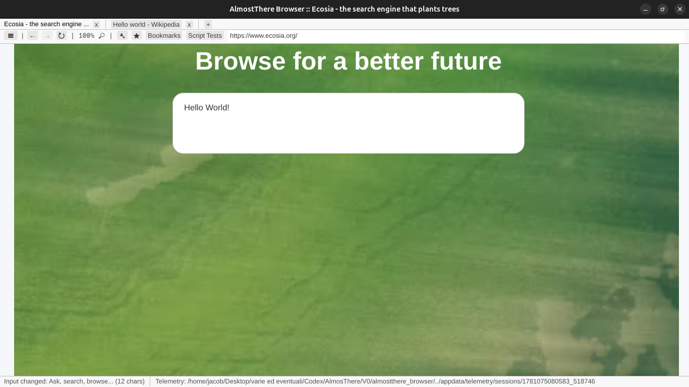

# AlmosThere-Browser

# ⚠️ AlmosThere Browser ⚠️ (WARNING: Vibe Coded Project)

**AlmosThere Browser** is a Browser that is Almost There to be an actual Browser, but we all know that it will never be! 

At the moment I wouldn't define it a Browser, it's just a Rust Demo Vibe Coded in Codex...

## ⚠️ DISCLAIMER!!! ⚠️

This project has been built from scratch in Rust and it is not related or endorsed in any case and in any way by more famous Browsers.

## 🚧 Planned Features 🚧 

- [x] Load HTML 5 Test Page 
- [x] Make the first search in Ecosia (Press Enter)
- [x] Support for HTTP/1.1 and HTTP/2
- [x] First custom Js engine build (JustBarelyScript, AKA JBS)
- [ ] Load correctly Ecosia
- [ ] Become an actual browser

## 📊 Benchmarks (Provisional) 📊

- [ ] JBS: ECMAScripts completion: 11516/53526 (21.5%)
- [ ] JBS: ECMAScripts completion (built-ins only): 6095/23585 (25.8%)

Stay Tuned!

